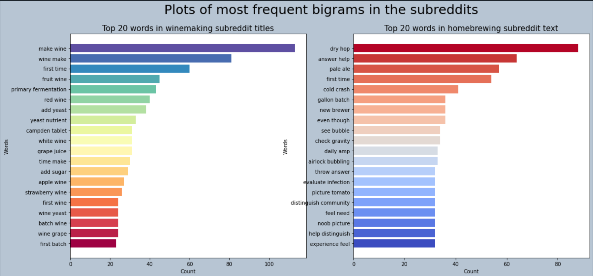
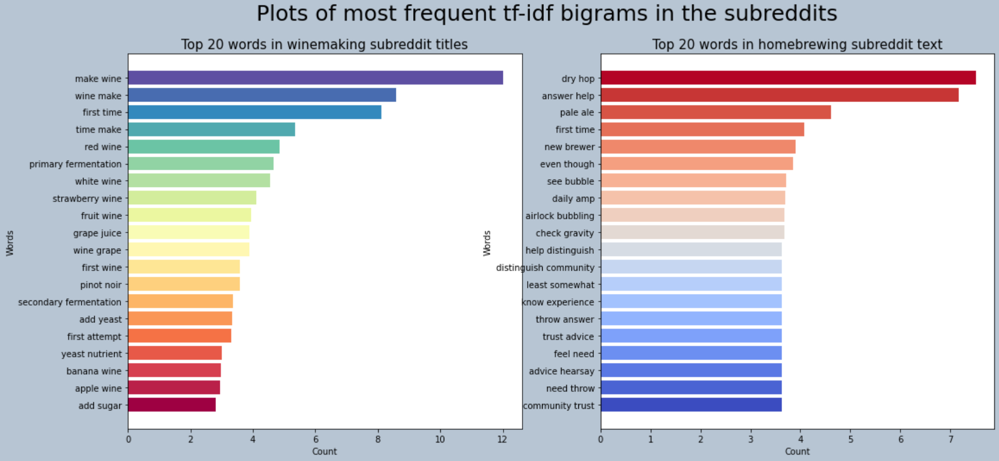

#  Project 3: Web APIs & NLP

# Problem Statement

With the advent of COVID-19, people have been hit by waves of lockdowns and have taken to starting new hobbies as ways to destress and to indulge in things they have always wanted to do. These include brewing and fermenting, which require little startup equipment but can make delicious alcoholic products for their friends and family. With the growing interest in these techniques, many companies and online services have sprung up to address this need, to provide forums which aspiring homebrewers and winemakers can get information and learn with their peers.

A new alcohol company wishes to understand consumer patterns with regard to winemaking and brewing, their two largest services. Since people are mostly stuck at home, many have taken to one or the other to pass time. The company wishes to create a chatbot which can take consumer queries and give them winemaking or homebrewing tips. However, due to these two processes having similar keywords (e.g. fermentation, tank), this is not a trivial task. To this end, they have requested a machine learning model from us which can identify whether the prospective customer wishes to know about homebrewing or winemaking.

To this end, we will be creating a machine learning model using posts from the Enology and Viticulture (r/winemaking) and Homebrewing (r/homebrewing) subreddits to train our model, and use the classifiers we have learnt so far to find the optimal model which can suit their needs and be integrated into their chatbot.

# Datasets

We will be scraping data from the top 1000 posts from the two subreddits: [r/winemaking](https://www.reddit.com/r/winemaking/) and [r/homebrewing](https://www.reddit.com/r/homebrewing/) to train our model.

# Data Cleaning
There were some posts with null, removed or deleted texts. The deleted post was removed, and the other two imputed with a null string. We removed unwanted noise like punctuations, delimiters, and stopwords, then lemmatized. The plots of the 20 most common unigrams and bigrams showed sufficient divergences to conclude that the two subreddits were sufficient for model building.

It seems that while 'make wine' appears way more often than 'make beer', the process is split between 'make beer', 'brewing beer', 'ferment beer', and 'homebrewing beer'. More posts seem to be about beer production, while the wine subreddit seems to have some discussion about wine styles. 

We can also see interesting sociolinguistic patterns - there are a number of first time brewers and winemakers who are looking for different styles to make, as 'first time' comes up relatively frequently in both subreddits. There are also more wine styles than beer styles that people are looking for, with wines being made from different fruits, whereas beer is usually beer, ginger beer, root beer or mead.

# Models

The models we considered are:
- logistic regression:
    * unigrams and bigrams
    * tf-idf
- KNN classifier:
    * unigrams and bigrams
    * tf-idf
- naïve bayes:
    * unigrams and bigrams
    * tf-idf
- random forest:
    * unigrams and bigrams
    * tf-idf
    
We performed grid searches on a number of hyperparameters for each model, balancing between computational efficiency and model fitting. The models were then compared based on their ROC-AUC and accuracy scores, which are shown in the table below

| models              | vectorizer   |   accuracy score |   auc score |
|:--------------------|:-------------|-----------------:|------------:|
| Logistic Regression | count        |            0.897 |       0.961 |
| Logistic Regression | tf-idf       |            0.917 |       0.975 |
| KNN Classifier      | count        |            0.72  |       0.851 |
| KNN Classifier      | tf-idf       |            0.58  |       0.655 |
| Naïve Bayes         | count        |            0.789 |       0.925 |
| Naïve Bayes         | tf-idf       |            0.789 |       0.925 |
| Random Forest       | count        |            0.89  |       0.964 |
| Random Forest       | tf-idf       |            0.888 |       0.966 |

The top 2 performing models were the logistic regression with tf-idf vectorizer and random forest with tf-idf vectorizer. The random forest model is less overfitted than the logistic regression model, but the latter has a good bias-variance tradeoff. We also see that the logistic regression model's accuracy score of 0.92 is significantly better than the baseline score of 0.5. We can thus conclude that the best model for our purposes is the **logistic regression with tf-idf vectorizer**.

It seems that the unigram/bigram mix has enough unique tokens to fit our model without too much overfitting. With more data and a more robust cleaning, we are confident that the model can be improved greatly to suit the customer's needs. But in the meantime, we are confident enough to present our model to the client as it has a relatively high score and would be able to sieve out whether any prospective customer would like to know about winemaking or homebrewing.

We could improve our model by adding a spell-checker for certain words that are spelt wrongly, which might improve the accuracy of the lemmatizer. Work could also be done in cleaning up emojis and other unwanted data to reduce the noise that goes into the models. These would reduce the overfitting in out best model, which would make it better at predicting new data.

Other models could also be explored like SVM and GLM, but they are outside the scope of this project.